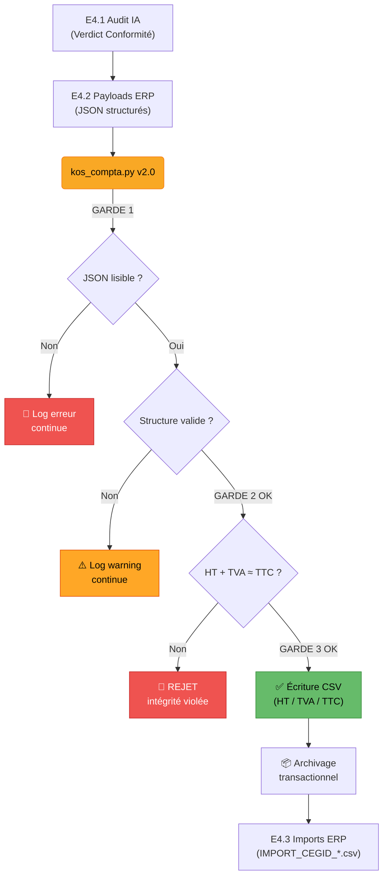

# Documentation Détaillée : KOS_COMPTA ERP Export (`kos_compta.py` v2.0)

## Contexte

Ce script est le **maillon final** du pipeline KOS_COMPTA. Il transforme les verdicts JSON produits par l'agent de conformité comptable en un fichier CSV normalisé, prêt à être importé dans un ERP type **CEGID**.

> _"Le KOS est le législateur. Le LLM est l'exécuteur. Le CI/CD est le tribunal."_

## Architecture Pipeline



## Les 3 Gardes de Sécurité (v2.0)

| Garde       | Fonction            | Mécanisme                                 | Conséquence si échec           |
| ----------- | ------------------- | ----------------------------------------- | ------------------------------ |
| **GARDE 1** | Lecture JSON        | `try/except json.JSONDecodeError`         | Fichier ignoré, batch continue |
| **GARDE 2** | Structure JSON      | `valider_structure_json()`                | Fichier ignoré, log warning    |
| **GARDE 3** | Intégrité comptable | `math.isclose(HT+TVA, TTC, abs_tol=0.01)` | Fichier **rejeté**, log erreur |

## Format JSON Attendu (Entrée)

```json
{
  "verdict": {
    "action_erp": "CONFORME",
    "imputation_recommandee": {
      "compte_debit": "62610",
      "compte_credit": "401",
      "montant_ht": 1000.0,
      "tva_deductible": 200.0,
      "montant_ttc": 1200.0
    }
  }
}
```

| Champ            | Rôle                   | Défaut        | Obligatoire |
| ---------------- | ---------------------- | ------------- | ----------- |
| `action_erp`     | Statut du verdict IA   | `"A_VALIDER"` | Non         |
| `compte_debit`   | Compte PCG de charge   | `"62888"`     | Non         |
| `compte_credit`  | Compte PCG fournisseur | `"401"`       | Non         |
| `montant_ht`     | Montant hors taxe      | —             | **Oui**     |
| `tva_deductible` | TVA récupérable        | `0`           | Non         |
| `montant_ttc`    | Montant TTC            | —             | **Oui**     |

## Format CSV Généré (Sortie)

Fichier : `IMPORT_CEGID_YYYYMMDD_HHMMSS.csv` (séparateur `;`)

| DATE       | JOURNAL | COMPTE | SENS | MONTANT | LIBELLE         | STATUT_KOS |
| ---------- | ------- | ------ | ---- | ------- | --------------- | ---------- |
| 26/02/2026 | ACH     | 62610  | D    | 1000.00 | Achat - FAC_001 | CONFORME   |
| 26/02/2026 | ACH     | 44566  | D    | 200.00  | Achat - FAC_001 | CONFORME   |
| 26/02/2026 | ACH     | 401    | C    | 1200.00 | Achat - FAC_001 | CONFORME   |

### Logique Comptable (Partie Double)

```
Débit  62610  (Charge)          1 000,00 €
Débit  44566  (TVA déductible)    200,00 €
                                ──────────
Crédit 401    (Fournisseur)     1 200,00 €   ← HT + TVA = TTC ✓
```

## Archivage Transactionnel (v2.0)

```
AVANT v2.0 (dangereux) :          APRÈS v2.0 (sûr) :
┌──────────────────────┐          ┌──────────────────────┐
│ for json in dossier: │          │ for json in dossier: │
│   écrire CSV         │          │   écrire CSV         │
│   archiver JSON  ◄── RISQUE    │   marquer pour       │
│                      │          │   archivage futur    │
│ (crash = perte)      │          │                      │
└──────────────────────┘          │ fermer CSV           │
                                  │ PUIS archiver tout ◄── SÛR
                                  └──────────────────────┘
```

## Rapport de Synthèse

Chaque exécution produit un rapport :

```
═══════════════════════════════════════════════════════════
 📊 RAPPORT D'EXÉCUTION KOS_COMPTA v2.0
═══════════════════════════════════════════════════════════
  📥 Payloads détectés   : 5
  ✅ Écritures générées  : 12
  📦 Fichiers archivés   : 4
  ⚠️  Fichiers ignorés    : 0
  🚫 Fichiers rejetés    : 1
  📂 Fichier ERP         : IMPORT_CEGID_20260226_170800.csv
═══════════════════════════════════════════════════════════
```

## Dépendances

- **Python 3.10+** (standard library uniquement)
- Modules : `json`, `csv`, `math`, `logging`, `pathlib`, `datetime`
- Aucun `pip install` requis
