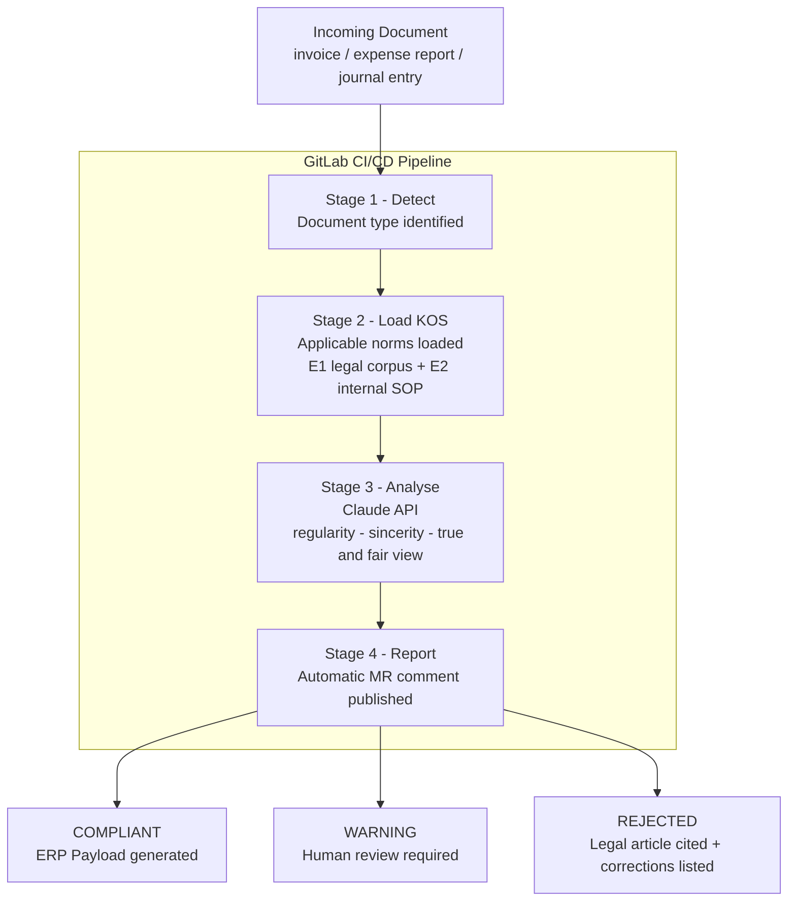
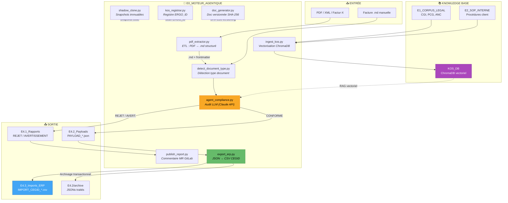

# KOS_COMPTA — AI Agent with CI/CD in Accounting and Compliance

> **GitLab AI Hackathon 2026**  
> _The KOS is the legislator. The LLM is the executor. The CI/CD is the tribunal._

---

## What is KOS_COMPTA ?

KOS*COMPTA is a **Compliance ERP Middleware** — an AI agent integrated into a GitLab CI/CD pipeline that intercepts accounting documents before they enter any ERP system, audits them against French law (\_régularité, sincérité, image fidèle* — Art. L123-14 Code de Commerce), and routes them accordingly.

**No illegal document enters the books.**

Built on top of a **Knowledge Operating System (KOS)** — a local knowledge base of structured JSON root files and vectorized French accounting norms — the system is fully LLM-agnostic. Swap the model, the compliance stays.

---

## Architecture

```
E0_MOTEUR_AGENTIQUE/       ← Brain — agent code + constitutional JSON files
E1_CORPUS_LEGAL_ETAT/      ← French law — PCG, TVA, CGI, ANC norms (read-only)
E2_SOP_INTERNE_ET_ERP/     ← Internal company rules + ERP config
E3_INTERFACES_ACTEURS/
  E3.1_Dropzone_Factures/  ← Incoming documents (invoices, expense reports)
  E3.2_Requetes_Assistants/ ← Free-form human queries (copilot mode)
E4_AUDIT_ET_ROUTAGE/
  E4.1_Rapports_Conformite/ ← REJECTED + WARNING reports (legal ref cited)
  E4.2_Payloads_ERP/        ← COMPLIANT payloads ready for ERP injection
  E4.3_Imports_ERP/         ← CSV files generated by export_erp.py (CEGID format)
```

---

## Pipeline — How it works



---

## Quick Start

```bash
# 1. Clone the repo
git clone https://gitlab.com/[USERNAME]/kos-compta.git
cd kos-compta

# 2. Install dependencies
pip install anthropic chromadb python-frontmatter fastapi

# 3. Set your API key
export ANTHROPIC_API_KEY=sk-ant-...

# 4. Drop a document in E3.1
cp my_invoice.md E3_INTERFACES_ACTEURS/E3.1_Dropzone_Factures/

# 5. Run the agent
python E0_MOTEUR_AGENTIQUE/agent_compliance.py

# 6. Check the result
ls E4_AUDIT_ET_ROUTAGE/E4.1_Rapports_Conformite/
ls E4_AUDIT_ET_ROUTAGE/E4.2_Payloads_ERP/
```

---

## Tech Stack

Python · YAML · JSON · SQL · Markdown · ChromaDB · GraphDB · GitLab CI/CD · GitLab Duo · Claude API (Anthropic) · Ollama · Gemini API · FastAPI · anthropic-sdk · PCG · CGI · Code de Commerce · BOFiP · CSV · Excel · Sage · EBP · Cegid · Pennylane · VS Code · Git · KOS

---

## Cahier des Charges — Hackathon MVP

> Toutes les tâches nécessaires pour une soumission viable et testable par le jury.  
> **Deadline : 25 mars 2026 — 14h00 EDT**

---

### BLOC 0 — GitLab Setup

> Priorité : IMMÉDIATE

- [ ] Créer compte sur gitlab.com
- [ ] Créer repo public `kos-compta`
- [ ] Pousser l'arborescence E0→E4 complète
- [ ] Vérifier que le repo est bien **public** (lisible sans compte)
- [ ] Remplir formulaire accès GitLab AI Hackathon Group ([lien](https://forms.gle/EeCH2WWUewK3eGmVA))
- [ ] Ajouter URL repo dans Devpost "Try it out"

---

### BLOC 1 — Agent Core (déjà produit, à valider)

> Priorité : HAUTE

- [x] `agent_compliance.py` — pipeline 5 étapes (lire → RAG → Claude → router → log)
- [x] `KOS_COMPTA_Taxonomie.json` — fichier constitutionnel
- [x] `KOS_COMPTA_Agentique.json` — règles agentiques
- [x] `KOS_COMPTA_Client_Log.json` — journal client
- [x] `loi_tva_cadeaux.md` — première norme E1
- [x] `brouillon_facture_A102.md` — cas de test
- [x] Tester `agent_compliance.py` localement avec `ANTHROPIC_API_KEY`
- [x] Vérifier que le rapport JSON sort bien dans E4.1
- [x] Vérifier que `ITERATIONS_LOG.json` se crée correctement

---

### BLOC 2 — Pipeline CI/CD GitLab

> Priorité : HAUTE — c'est le cœur du hackathon

- [x] Compléter `.gitlab-ci.yml` avec les 4 stages opérationnels
- [x] Créer `detect_document_type.py` — identifie le type de document
- [ ] Créer `load_kos.py` — charge les normes depuis E1+E2
- [x] Créer `publish_report.py` — poste le verdict en commentaire MR
- [ ] Tester un push → vérifier que le pipeline se déclenche sur GitLab
- [ ] Tester une Merge Request → vérifier le commentaire automatique
- [ ] Vérifier que le pipeline passe en moins de 2 minutes

---

### BLOC 3 — Corpus Légal E1 (révision BTS = construction KOS)

> Priorité : MOYENNE — minimum 3 normes pour la démo

- [ ] `pcg_classes_1_a_4.md` — comptes capitaux, tiers, financiers
- [ ] `pcg_classes_5_a_8.md` — comptes de stocks, charges, produits
- [ ] `tva_regles_generales.md` — taux 5.5% / 10% / 20% + cas
- [ ] `mentions_obligatoires_facture.md` — CGI Art.289
- [ ] `cycle_achat_normes.md` — 5 étapes du cycle achat
- [ ] `cycle_vente_normes.md` — 5 étapes du cycle vente
- [ ] `normes_bilan_actif_passif.md` — ANC 2014-03
- [ ] `principes_comptables_generaux.md` — Art. L123-14 + 9 principes

---

### BLOC 4 — Tests & Cas Démo

> Priorité : HAUTE — le jury doit voir le pipeline tourner

- [x] Cas A102 — champagne 120€ TTC → REJET TVA (déjà fait)
- [x] Cas B001 — facture conforme → CONFORME + payload ERP
- [x] Cas C001 — facture sans numéro TVA → REJET mentions obligatoires
- [x] Cas D001 — note de frais repas 18€ → CONFORME
- [x] Cas E001 — note de frais repas 120€ sans justificatif → AVERTISSEMENT
- [x] Vérifier que chaque cas produit le bon verdict + le bon fichier dans E4

---

### BLOC 5 — Démo Vidéo 2 minutes

> Priorité : HAUTE — livrable obligatoire Devpost

- [ ] Script de démo écrit (ce qu'on dit + ce qu'on montre à chaque seconde)
- [ ] Enregistrement écran : dépôt facture A102 → pipeline GitLab → verdict
- [ ] Voix off ou sous-titres explicatifs
- [ ] Upload YouTube / Vimeo (non-listé)
- [ ] Lien vidéo ajouté sur Devpost

---

### BLOC 6 — Devpost Finalisation

> Priorité : HAUTE — deadline 25 mars

- [x] Project name : KOS_COMPTA
- [x] Elevator pitch
- [x] About the project (Project Story)
- [x] Built with
- [ ] Try it out link (URL repo GitLab)
- [ ] Vidéo démo uploadée
- [ ] Image gallery (screenshot pipeline + rapport JSON)
- [ ] Soumettre avant 25 mars 14h00 EDT (20h00 heure française)

---

## 🚀 Roadmap & Vision Produit

KOS_COMPTA a été pensé dès le premier jour comme une architecture évolutive (Ergodique). Le POC actuel démontre la viabilité du RAG Agentique, mais la roadmap technique prévoit déjà les prochaines révolutions fiscales.

### 1. V2 - Veille Légale Curative (Self-Healing RAG)

Actuellement, le corpus de lois (Dossier `E1`) est statique. La V2 intégrera une boucle de **Veille Curative** :

- Connexion via API à **PISTE (Légifrance)**.
- Déclenchement par GitLab CI/CD : si un article du Code Général des Impôts (CGI) est modifié, le système met à jour automatiquement la base vectorielle (ChromaDB) de l'agent.
- L'IA n'est plus seulement experte, elle devient juridiquement intemporelle.

### 2. V3 - Anticipation Réforme 2026 (Factur-X)

En septembre 2026, la facturation électronique structurée deviendra obligatoire en France pour les entreprises.

- **Le problème :** La fin du PDF simple (donnée non structurée).
- **La solution KOS :** Le script d'ingestion `pdf_extractor.py` sera mis à jour pour lire nativement le flux **XML (Factur-X)** embarqué dans les nouvelles factures.
- **L'avantage :** L'Agent LLM n'aura plus besoin de faire de l'OCR incertain, il recevra une donnée d'entrée fiable à 100 %, lui permettant de se concentrer uniquement sur l'audit fiscal et la détection de fraudes.

---

## Workflow — Relations entre Scripts



---

## Legal Foundation

| Principe     | Référence                     | Portée                                     |
| ------------ | ----------------------------- | ------------------------------------------ |
| Régularité   | Code de Commerce Art. L123-14 | Conformité aux règles en vigueur           |
| Sincérité    | Code de Commerce Art. L123-14 | Bonne foi, réalité économique              |
| Image fidèle | Code de Commerce Art. L123-14 | Patrimoine, situation financière, résultat |

> _Note : Article L123-14 constitue le socle minimal — non exhaustif. Des prescriptions complémentaires s'appliquent selon le secteur et la forme juridique._

---

## Author

**ERGO Capital — Adam**  
BTS Comptabilité et Gestion · Alternance Toulouse  
Bachelor Data & IA (en cours)  
Autodidacte MLOps · KOS builder since GPT-3

---

_KOS_COMPTA : L'automatisation par la preuve._
